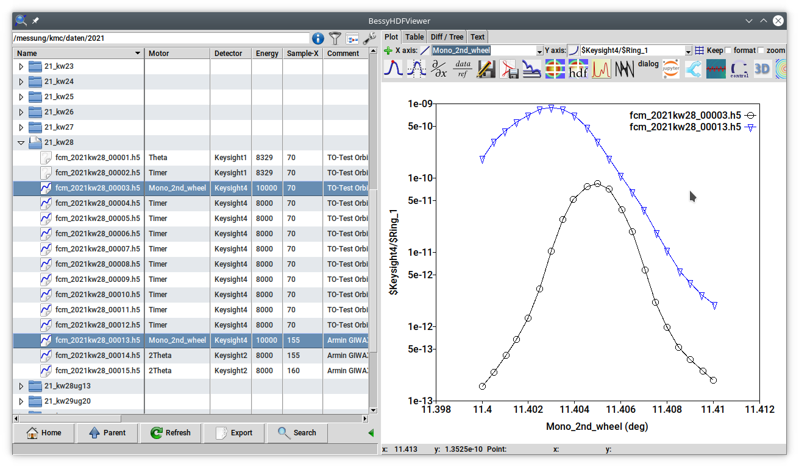

BessyHDFViewer
==============



BessyHDFViewer is a data visualization software for the data files generated by the [eveCSS](https://github.com/eveCSS) data recording software.
[eveCSS](https://github.com/eveCSS) is developed by the [working group 7.25](https://www.ptb.de/cms/en/ptb/fachabteilungen/abt7/fb-72/ag-725.html) of the Physikalisch-Technische Bundesanstalt (PTB) and used by departments [7.1](https://www.ptb.de/cms/en/ptb/fachabteilungen/abt7/fb-71.html) and [7.2](https://www.ptb.de/cms/en/ptb/fachabteilungen/abt7/fb-72.html) at the [synchrotron radiation facility BESSY II](https://www.helmholtz-berlin.de/forschung/quellen/bessy/index_en.html) in Berlin to record all measurement data in a consistent data format. 

With BessyHDFViewer you can:
 * Browse a directory of measurement files and quickly get an overview what is contained
 * Plot arbitrary columns of the data files into 2D line graphs
 * Perform some basic computation (algebra on arbitrary columns, peak finding, numerical derivative, dataset normalization)
 * Export plots and data as PDF graphs and ASCII files
 * Find differences between similar measurements
 * Search data files containing keywords or given data ranges
 * In addition to HDF5 files from eveCSS, plot whitespace-separated ASCII files and the older HDF4 format of PTB

BessyHDFViewer is written in [Tcl/Tk](https://wiki.tcl-lang.org/) and can be extended by plugins written either in Tcl, or as independent programs in other languages, such as [Python](https://www.python.org/).


Binary Installation
===================

You can use the precompiled binaries as the result from Github Actions available at the [Release page](https://github.com/BessyHDFViewer/BessyHDFViewer/releases). Using these depends on the system:
 * Windows: Copy [``BessyHDFViewer.exe``](https://github.com/BessyHDFViewer/BessyHDFViewer/releases/download/latest/BessyHDFViewer.exe) to some directory, e.g. your desktop, and run by double-clicking.
 * macOS: Open [``BessyHDFViewer.dmg``](https://github.com/BessyHDFViewer/BessyHDFViewer/releases/download/latest/BessyHDFViewer.dmg) and drag the icon to your applications folder. The binary is not signed, you must right-click first and accept to execute as an unsigned binary
 * Linux: Copy [``BessyHDFViewer_Linux64``](https://github.com/BessyHDFViewer/BessyHDFViewer/releases/download/latest/BessyHDFViewer_Linux64) into your path, e.g. ``/usr/local/bin`` and make it executable:
    chmod +x https://github.com/BessyHDFViewer/HDFpp/releases


Installation from source
========================

This repository only contains the Tcl code, not the compiled code for the execution of BessyHDFViewer (Tcl interpreter and the [HDFpp library](https://github.com/BessyHDFViewer/HDFpp) for reading HDF files. For convenience, the script ``make-dependencies.sh`` can be used, which downloads the binaries from the latest Github release. In order to run BessyHDFViewer from the directory of the repo, do:

    ./make-dependencies.sh
    make linuxapp

``linuxapp``must be replaced by ``macapp``and ``winapp`` for the corresponding platform. This creates a binary under ``dist/``.
Once the dependencies are installed using this command, you can also run the code can directly from the repository for development; to do this, run

```
	make run
```

```
    BessyHDFViewer is free software: you can redistribute it and/or modify
    it under the terms of the GNU General Public License as published by
    the Free Software Foundation, either version 3 of the License, or
    (at your option) any later version.

    BessyHDFViewer is distributed in the hope that it will be useful,
    but WITHOUT ANY WARRANTY; without even the implied warranty of
    MERCHANTABILITY or FITNESS FOR A PARTICULAR PURPOSE.  See the
    GNU General Public License for more details.

    You should have received a copy of the GNU General Public License
    along with BessyHDFViewer.  If not, see <https://www.gnu.org/licenses/>.

``` 


